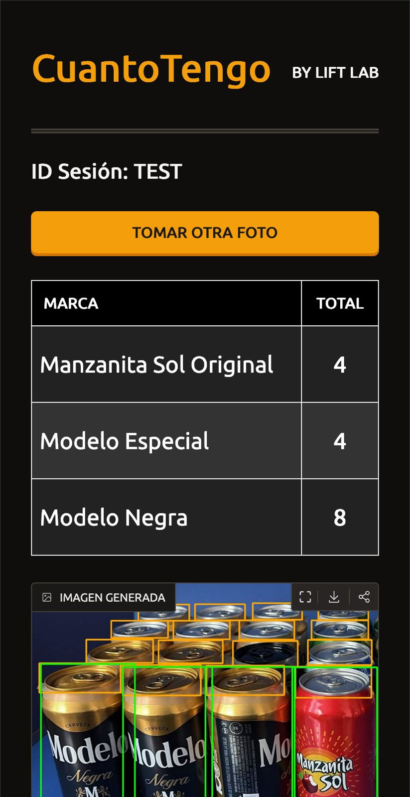

# CuantoTengo-Web-App

<p align="center">
  <a href="#research-context">Research Context</a> •
  <a href="#infrastructure">Infrastructure</a> •
  <a href="#installation">Installation</a>
</p>

<div style="text-align: center;">
  
</div>

CuantoTengo is a mobile-first inventory management tool that uses computer vision to automatically recognize and count products from a single image captured with a smartphone.
The system detects cans displayed on shelves, enabling small businesses to perform fast and accurate inventory counts without specialized hardware or barcode scanners.

## Research Context
Traditional inventory counting is time-consuming, error-prone, and often inaccessible for small retailers. CuantoTengo addresses this problem by leveraging advanced computer vision models to transform a simple photo into structured inventory data.

From a single image, the system:
- Detects individual products
- Classifies product types listing them in groups
- Counts instances per category
- Returns results in near real time

## Infrastructure

<table>
  <tr>
    <td><strong>Web Development Frameworks</strong></td>
    <td>
      
      
    </td>
  </tr>
  <tr>
    <td><strong>Backend | Data Analytics</strong></td>
    <td>
      
      
    </td>
  </tr>
  <tr>
    <td><strong>Computer Vision</strong></td>
    <td>
      
      
      
    </td>
  </tr>
</table>

## Project Structure

```bash
.
├── README.md
├── app.py
├── azure_blob_storage.py
├── azure_loader.py
├── images
│   └── ...
├── inference
│   ├── config.py
│   ├── detection
│   │   ├── cap_detection.py
│   │   ├── column_detection.py
│   │   ├── front_detection.py
│   │   ├── gpt_detection.py
│   │   └── local_brand_detection.py
│   ├── final_aggregation.py
│   ├── image_utils.py
│   ├── main_inference.py
│   ├── plots.py
│   └── runtime
│       ├── device.py
│       └── models.py
├── models
│   ├── bottle_can_cap_yolo_weights.pt
│   ├── bottlefront_weights.pt
│   ├── brand_model_3class.pt
│   └── brand_model_3class_lab.pt
├── qualtrics_survey.py
└── requirements.txt
```

## Installation

### Prerequisites

- [Python3.11](https://www.python.org/downloads/release/python-3110/)

### Manual Installation

```bash
# Clone the repository
git clone https://github.com/Roombreak/SGAC-Shelf-Geometry-Aware-Counting
```

### Set environment and run service

```bash
# Create virtual environment
python -m venv venv

# Activate virtual environment (macOS / Linux)
source venv/bin/activate

# Install dependencies
pip install -r requirements.txt

# Run the application
python app.py
```

The Gradio app will be available at [http://localhost:7860/](http://localhost:7860/).

## Environment Variables Configuration 
Set these as your environment variables or create a `.env` file. The variables should be structured as follows:

```bash
BRAND_DETECTION_VERSION=... #MEX or LAB or GPT 
AZURE_CONTAINER=...
AZURE_STORAGE_CONNECTION_STRING=...
OPENAI_API_KEY=...
```

See [`.env.example`][.env] for an example environment.

---

##### Developed by Eduardo Porto [@Porto1090](https://github.com/Porto1090)
##### Developed by Junyi Sha [@Rombreak](https://github.com/Rombreak)

[.env]: /.env.example